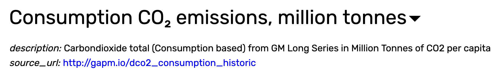
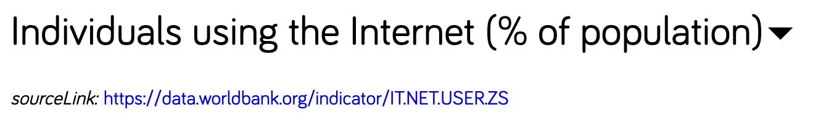
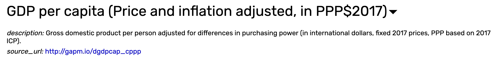
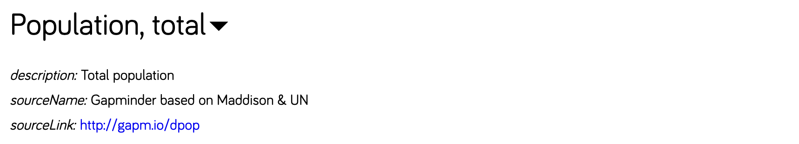

Every analytics project MUST start from a question. I have been always curious about the explosive growth of the Internet, especially as someone who built his career on enabling wider adoption of Internet in fields that traditionally not rely on the Internet. I want to know if Internet usage is bringing bad effect to CO2 emission - [one of the variable most strongly linked to global warming](https://www.climate.gov/news-features/understanding-climate/climate-change-atmospheric-carbon-dioxide#:~:text=Without%20carbon%20dioxide%2C%20Earth's%20natural,causing%20global%20temperature%20to%20rise.).

The Internet - and the digital age at large - has been viewed as mainly bringing net postive. [It powers education and economy. It supports our health and well-being. It also connects individuals to their community and their loved ones](https://www.internetforall.gov/why). However, as I got older, I kept finding myself contemplating whether or not the overwhelming positive overshadows a potentialy serious downside. For me, an environmental impact is one area that I believe will grow in urgency as we are going to keep witnessing the impact of a changing climate on our everyday life. For this analytics project, not only I want to know if every country is making more co2 emission with higher internet useage, but also if there is anomaly out there where a country managed to power their internet growth from sustainable sources.

## The Source of Data

Answering my question requires a solid data that come from a reputable source. I picked the [gapminder](https://www.gapminder.org/data/) dataset for this project. This dataset hold statistical variables about all UN member countries on social, economic, and environmental development. Gapminder, an education organization whose mission is to provide fact-based worldview, is doing some amazing job in challenging [widely held public misconception](https://www.gapminder.org/ignorance/studies/global-misconception-study-2019/) on various issues such as global warming, plastic in oceans, international conflict, and many others. To support this mission, they maintain their own rigorously fact-checked data sets.

## The Data

Gapminder has one data that listed CO2 emission of each countries, this is going to be our main variable.

It also has data of % of population who is using the internet. This is going to be used as our secondary variable.

The simplest form of analytical question is looking for association. One study by [Salahuddin, Alam, and Ozturk (2016)](https://www.sciencedirect.com/science/article/abs/pii/S1364032116300351) suggested that the association between CO2 emission and internet user rate is a positive correlation among OECD countries, although they also stated that the rapid growth of the internet is not an environmental threat. It quoted other studies that suggested that internet usage growth increases electricity consumption - a known contributor of CO2 emission.

Reading this, I plan to introduce economic level as the next secondary variable. It is a good variable to check if we can control for the effect of wealth. If high economic activity consistently associated with higher emission, it means we might be able to disentagle the effect of internet from general economic activities. We can use Gapminder GDP percapita as a proxy metric for economic level.

To complement this variable, we are going to pull total population as well, in case we need to refer to the number of population instead of the ratio.

 

Previously mentioning electricity consumption lead me to also include oil consumption to provide insight into energy sources. This can add nuance to the analysis that shows if a country can grow with internet with minimal impact to environment by embracing non-oil energy sources.

## The Analysis

For the next articles in this series, I am going to do data exploring and preprocessing, where we are going to see visualized summary of CO2 emission data and other variables by country. Steps might also be needed to clean the data, such as handling missing data, standardizing unit if necessary, and other necessary steps to make our data ready for analysis. We might also be able to start initial observation about high-emission vs low-emission countries with visuals.

The next step is, of course, to try to find the association between variables. I will try to introduce the statistical method used to measure the association, show the calculated statistics, and try to describe what the calculation implied. As with any statistics, careful caveats need to be taken into account, and I will try to include this as much as possible.

With statistical association established, we can try to get a closer look at how different countries compare in terms of emission and internet usage. Using segmentation might be needed to reveal underlying pattern, if a pattern is there to be discovered. Identifying these patterns also enables us to highlight outliers, examining why certain countries deviate from the norm, provided these outliers are present in the data.

And lastly, I will try to incomporate everything into reflections of what we have learned.