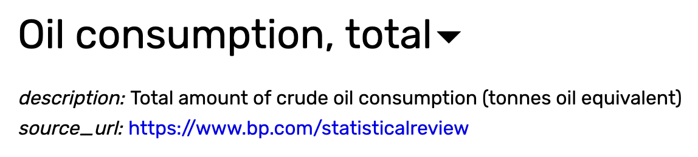

One often overlooked aspect of data analysis project is keeping track of the data that we are working on. Our data will evolve during the course of analysis project, sometime new variables will be introduced, sometimes we redefined an old variables, or sometimes we dropped a variable that deemed no longer relevant. <!-- more --> Whatever the reason is, it make a good sense that we keep track of the changes in our data. This is where a code book comes in handy. Code books are simply a document where we put information about our data. At the very least we want to keep track of our variable names, their description, and the unit of measurement.

Most of the times, we want our code book to reflect the most recent state of our data. So any variable that has been dropped from our analysis is also dropped from our code book, and if a variable is redefined we only put the most recent description and discard the old description altogether. Doing this gave us the advantage that let us focus on our current analysis. We want to do this unless there is a good reason that we need access to all evolution that happens on our code book. One way to accommodate this is by making a new copy whenever we modify the code book, we will end up with many copies of the code book which is why it is not ideal. Another way, and a slightly better way, is by putting our codebook on version control. We are going to have a separate discussion on how to put the analytics project on version control, not just the code book, so for now just know that this alternative exists.

## CO2 Emission Code book

Recall from our previous step that we are going to work with several variables, they are `CO2 emissions` of each countries, their `internet user rate`, their `total population`, `GDP per capita`, and `oil consumption per capita`.

We have actually put a makeshift code book by putting together the definition of each variables from gapminder website.

However, above images are not easy to read, hence we are going to create a separate spread sheet to hold all of these information in tabular format.
 

This spreadsheet is now our code book. Immediately we can see a lot of improvement. We now know that many variables are in per capita unit, later on in our analysis we might have to multiple this number to the total population to get the number of total country measurement.   

We are going to keep this spreadsheet file updated whenever we make a change in our data. I will show the latest state of our code book at the end of each articles.
